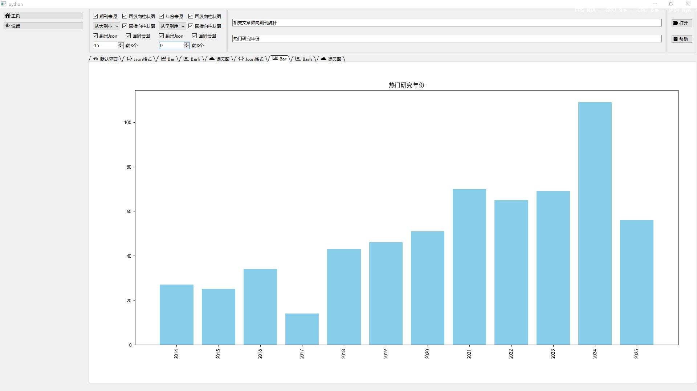
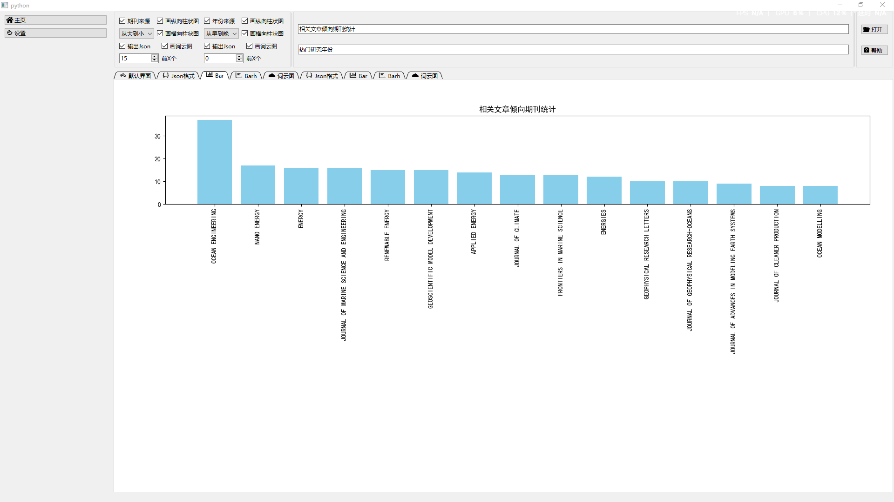
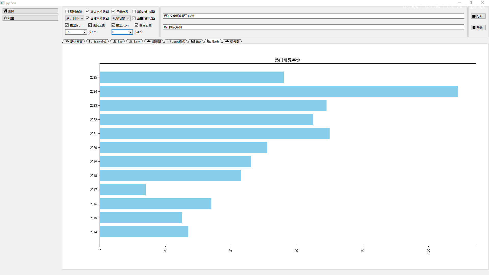
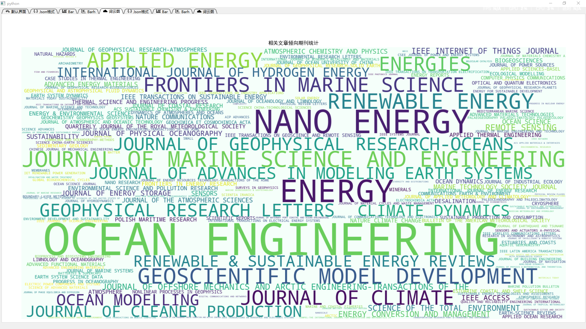

# 基于WOS导出文献完整记录做数据可视化分析

说明：WOS导出的每一项文献都是以PT开始并且以ER结尾，我称之为一栏。

下面是对于标记的信息映射表说明。

| 标记 | 信息   |
|----|------|
| SO | 期刊   |
| PY | 发表年份 |
|    |      |
|    |      |
|    |      |

## 特点说明
- 该程序是可拓展的，比如说可视化方面添加一个气泡图分析，又或者分析方面添加文献类型（DT字段），甚至你可以设置别的数据库的导出格式
- 功能核心是多线程的，可以轻松拓展新功能到新线程

## Example

> 在大量（如下图，200+期刊源，柱状图表现很差，于是需要词云或者其他图显示）
> 
